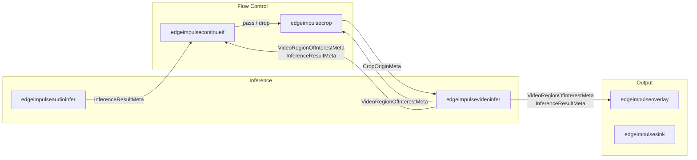
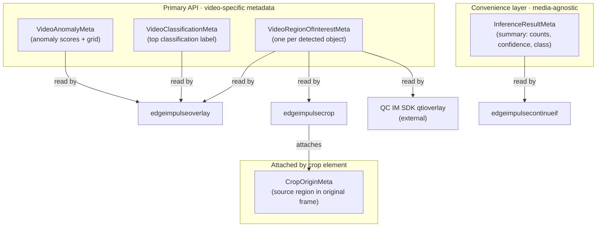
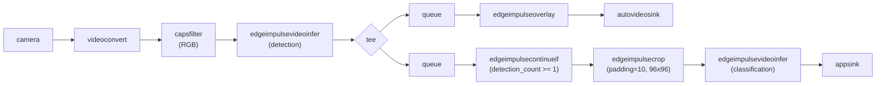
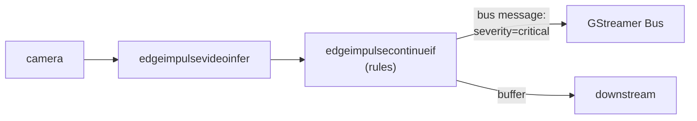
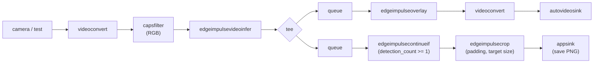

# GStreamer Edge Impulse Plugin
[](https://github.com/edgeimpulse/gst-plugins-edgeimpulse/actions/workflows/ci.yml)
[](https://edgeimpulse.github.io/gst-plugins-edgeimpulse/)

A GStreamer plugin that enables real-time machine learning inference and data ingestion using Edge Impulse models and APIs. The plugin provides six elements for audio and video inference, visualization, ingestion, and pipeline flow control.

## Architecture Overview



### Elements at a glance

| Element | Description | Media |
|---------|-------------|-------|
| [`edgeimpulseaudioinfer`](docs/edgeimpulseaudioinfer.md) | Runs audio inference (classification, keyword spotting) | Audio |
| [`edgeimpulsevideoinfer`](docs/edgeimpulsevideoinfer.md) | Runs video inference (classification, detection, anomaly) | Video |
| [`edgeimpulseoverlay`](docs/edgeimpulseoverlay.md) | Draws bounding boxes and labels on video frames | Video |
| [`edgeimpulsesink`](docs/edgeimpulsesink.md) | Uploads audio/video to Edge Impulse ingestion API | Audio / Video |
| [`edgeimpulsecontinueif`](docs/edgeimpulsecontinueif.md) | Conditional gate — passes or drops buffers based on inference metadata | Any |
| [`edgeimpulsecrop`](docs/edgeimpulsecrop.md) | Extracts per-detection crop regions from video frames (1-to-N) | Video |

### Metadata flow

Inference elements attach metadata to every buffer they process. Downstream elements read this metadata to make decisions or visualize results. See [Public API: Inference and Ingestion Output](#public-api-inference-and-ingestion-output) for the complete metadata reference.



### Common pipeline patterns

#### Single-stage video inference with overlay


```bash
gst-launch-1.0 v4l2src ! videoconvert ! video/x-raw,format=RGB ! \
    edgeimpulsevideoinfer ! edgeimpulseoverlay ! autovideosink
```

#### Two-stage detection + classification with crop

This pattern uses a detection model to find objects, gates on detection count, crops each detection, and runs a second classification model on each crop individually:



```bash
gst-launch-1.0 v4l2src ! videoconvert ! video/x-raw,format=RGB ! \
    edgeimpulsevideoinfer ! tee name=t \
    t. ! queue ! edgeimpulseoverlay ! autovideosink \
    t. ! queue ! edgeimpulsecontinueif condition="detection_count >= 1" ! \
        edgeimpulsecrop padding=10 target-width=96 target-height=96 ! \
        edgeimpulsevideoinfer_classification ! fakesink
```

#### Audio inference


```bash
gst-launch-1.0 autoaudiosrc ! audioconvert ! audioresample ! \
    audio/x-raw,format=S16LE,channels=1,rate=16000 ! \
    edgeimpulseaudioinfer ! audioconvert ! autoaudiosink
```

#### Conditional gating with rules-based metadata

Use the `rules` property to emit structured metadata based on inference results, enabling downstream logic without writing custom code:



```bash
gst-launch-1.0 v4l2src ! videoconvert ! video/x-raw,format=RGB ! \
    edgeimpulsevideoinfer ! \
    edgeimpulsecontinueif condition="detection_count >= 1" \
        rules='[
            {"condition":"detection_count > 4","metadata":{"severity":"critical","color":"purple"}},
            {"condition":"detection_count >= 1","metadata":{"severity":"warning","color":"red"}},
            {"condition":"detection_count == 0","metadata":{"severity":"ok","color":"green"}}
        ]' ! \
    fakesink
```

## Public API: Inference and Ingestion Output

The plugin exposes results and ingestion status through three mechanisms:

### 1. GStreamer Bus Messages

All inference elements emit structured messages on the GStreamer bus with the name `edge-impulse-inference-result`. The ingestion element (`edgeimpulsesink`) emits:
- `edge-impulse-ingestion-result`: Sent when a sample is successfully ingested (fields: filename, media type, length, label, category).
- `edge-impulse-ingestion-error`: Sent when ingestion fails (fields: filename, media type, error, label, category).

The `edgeimpulsecontinueif` element can also emit `edge-impulse-continue-if-metadata` bus messages when `rules` are configured (see [edgeimpulsecontinueif](#edgeimpulsecontinueif)).

### 2. Video Frame Metadata (Primary API)

These are the **primary metadata API** for all downstream consumers — including `edgeimpulseoverlay`, `edgeimpulsecrop`, and external elements such as Qualcomm IM SDK's `qtioverlay`. Any element that reads inference results from video buffers should use these types.

#### VideoRegionOfInterestMeta

Attached by `edgeimpulsevideoinfer` — one per detected object for object detection, or a single frame-sized ROI for classification.

| Field | Type | Description |
|-------|------|-------------|
| `x` | u32 | X coordinate of the top-left corner (pixels) |
| `y` | u32 | Y coordinate of the top-left corner (pixels) |
| `width` | u32 | Width of the region (pixels) |
| `height` | u32 | Height of the region (pixels) |
| `label` | String | Class label or description |

For object detection, each detected object is a separate ROI. For classification, a single ROI covers the whole frame with the top label. For visual anomaly detection, the ROI may include anomaly scores and grid data as additional metadata.

#### VideoClassificationMeta

Attached by `edgeimpulsevideoinfer` for classification results. Contains the top classification label and confidence score.

#### VideoAnomalyMeta

Attached by `edgeimpulsevideoinfer` for anomaly detection results:

| Field | Type | Description |
|-------|------|-------------|
| `anomaly` | f64 | Overall anomaly score for the frame |
| `visual_anomaly_max` | f64 | Maximum anomaly score in the grid |
| `visual_anomaly_mean` | f64 | Mean anomaly score in the grid |
| `visual_anomaly_grid` | list | Grid cells, each with region (`x`, `y`, `width`, `height`) and anomaly `value` |

Optionally, each grid cell may also be represented as a `VideoRegionOfInterestMeta`, enabling visualization overlays.

### 3. InferenceResultMeta (Convenience Layer)

`InferenceResultMeta` is an **additional convenience layer** — it does **not** replace the video-specific metadata above. It provides a media-agnostic summary attached to both audio and video buffers, so flow-control elements like `edgeimpulsecontinueif` can evaluate gate conditions without parsing video-specific metadata.

> **Compatibility note:** `VideoRegionOfInterestMeta` and friends remain the primary interface for all downstream consumers (including the Qualcomm IM SDK). `InferenceResultMeta` supplements them with a pre-computed summary for flow-control use cases.

| Field | Type | Description |
|-------|------|-------------|
| `inference_type` | String | `"object-detection"`, `"classification"`, `"anomaly-detection"`, etc. |
| `result_json` | String | Raw JSON result string from the model |
| `detection_count` | u32 | Number of detected bounding boxes |
| `max_confidence` | f64 | Highest confidence across all detections/classifications |
| `top_class` | String | Label of the highest-confidence class |
| `top_confidence` | f64 | Confidence of `top_class` |
| `anomaly_score` | f64 | Overall anomaly score (0.0 if not anomaly) |
| `visual_anomaly_max` | f64 | Peak visual anomaly grid score (0.0 if not visual anomaly) |

### 4. CropOriginMeta

Attached by `edgeimpulsecrop` to each cropped buffer, recording where the crop came from in the original frame so downstream classification results can be mapped back to full-frame coordinates:

| Field | Type | Description |
|-------|------|-------------|
| `source_x` | u32 | X offset of the crop in the original frame |
| `source_y` | u32 | Y offset of the crop in the original frame |
| `source_width` | u32 | Width of the crop region (before resize) |
| `source_height` | u32 | Height of the crop region (before resize) |
| `original_width` | u32 | Width of the original frame |
| `original_height` | u32 | Height of the original frame |
| `object_id` | u64 | Object tracking ID from upstream detection |
| `detection_label` | String | Detection class label |
| `detection_confidence` | f64 | Detection confidence score |

> **Note:** Audio elements only emit bus messages and `InferenceResultMeta`; video elements emit bus messages plus all metadata types above.

### Supported Model Types and Output Formats

#### 1. Object Detection
- **Bus Message Example:**
  ```json
  {
    "timestamp": 1234567890,
    "type": "object-detection",
    "result": {
      "bounding_boxes": [
        {
          "label": "person",
          "value": 0.95,
          "x": 24,
          "y": 145,
          "width": 352,
          "height": 239,
          "object_id": 1
        }
      ]
    }
  }
  ```
- **Video Metadata:** Each detected object → `VideoRegionOfInterestMeta` (see [above](#videoregionofinterestmeta)). When object tracking is enabled, `object_id` is also included.

#### 1.1. Object Tracking
- **Bus Message Example:**
  ```json
  {
    "timestamp": 1234567890,
    "type": "object-tracking",
    "result": {
      "object_tracking": [
        {
          "label": "person",
          "value": 0.95,
          "x": 24,
          "y": 145,
          "width": 352,
          "height": 239,
          "object_id": 1
        }
      ]
    }
  }
  ```
- **Video Metadata:** Same as object detection, with `object_id` for cross-frame tracking.

#### 2. Classification
- **Bus Message Example:**
  ```json
  {
    "timestamp": 1234567890,
    "type": "classification",
    "result": {
      "classification": {
        "cat": 0.85,
        "dog": 0.15
      }
    }
  }
  ```
- **Video Metadata:** Top result → `VideoClassificationMeta` (see [above](#videoclassificationmeta)). May also attach a single frame-sized `VideoRegionOfInterestMeta` with the top label.

#### 3. Visual Anomaly Detection
- **Bus Message Example:**
  ```json
  {
    "timestamp": 1234567890,
    "type": "anomaly-detection",
    "result": {
      "anomaly": 0.35,
      "classification": {
        "normal": 0.85,
        "anomalous": 0.15
      },
      "visual_anomaly_max": 0.42,
      "visual_anomaly_mean": 0.21,
      "visual_anomaly_grid": [
        { "x": 0, "y": 0, "width": 32, "height": 32, "value": 0.12 },
        { "x": 32, "y": 0, "width": 32, "height": 32, "value": 0.18 }
        // ... more grid cells ...
      ]
    }
  }
  ```
- **Video Metadata:** Scores → `VideoAnomalyMeta` (see [above](#videoanomalymeta)). Grid cells may also be attached as individual `VideoRegionOfInterestMeta` entries for overlay visualization.

## Dependencies

### System Dependencies
This plugin requires additional system libraries for overlay rendering:

**On macOS (with Homebrew):**
```bash
brew install pango cairo xorgproto libx11
```

**Note:** We recommend installing GStreamer from official binaries (see step 2 above) rather than via Homebrew to avoid potential version conflicts.

**On Ubuntu/Debian:**
```bash
sudo apt-get update
sudo apt-get install libpango1.0-dev libcairo2-dev libx11-dev libxext-dev libxrender-dev \
    libxcb1-dev libxau-dev libxdmcp-dev libxorg-dev
```

**On CentOS/RHEL/Fedora:**
```bash
sudo dnf install pango-devel cairo-devel libX11-devel libXext-devel libXrender-devel \
    libxcb-devel libXau-devel libXdmcp-devel xorg-x11-proto-devel
```

### Edge Impulse Rust Dependencies
* [edge-impulse-runner-rs](https://github.com/edgeimpulse/edge-impulse-runner-rs) - Rust bindings for Edge Impulse Linux SDK
* [edge-impulse-ffi-rs](https://github.com/edgeimpulse/edge-impulse-ffi-rs) - FFI bindings for Edge Impulse C++ SDK (used by runner-rs)

**Note:** The plugin inherits all build flags and environment variables supported by the underlying FFI crate. See the [edge-impulse-ffi-rs documentation](https://github.com/edgeimpulse/edge-impulse-ffi-rs) for the complete list of supported platforms, accelerators, and build options.

## Installation

### 1. Install Rust
First, install the Rust toolchain using rustup:

```bash
# On Unix-like OS (Linux, macOS)
curl --proto '=https' --tlsv1.2 -sSf https://sh.rustup.rs | sh
```

Follow the prompts to complete the installation. After installation, restart your terminal to ensure the Rust tools are in your PATH.

### 2. Install GStreamer

#### macOS
Download and install GStreamer from the official binaries:
- [Runtime installer](https://gstreamer.freedesktop.org/data/pkg/osx/1.24.12/gstreamer-1.0-1.24.12-universal.pkg)
- [Development installer](https://gstreamer.freedesktop.org/data/pkg/osx/1.24.12/gstreamer-1.0-devel-1.24.12-universal.pkg)

**Note:** Install both packages for complete GStreamer development support.

#### Linux
Install from your distribution's package manager. For example:

Ubuntu/Debian:
```bash
sudo apt-get install \
    libgstreamer1.0-dev \
    libgstreamer-plugins-base1.0-dev \
    gstreamer1.0-plugins-base \
    gstreamer1.0-plugins-good \
    gstreamer1.0-libav \
    gstreamer1.0-tools \
    gstreamer1.0-x \
    gstreamer1.0-alsa \
    gstreamer1.0-gl \
    gstreamer1.0-gtk3 \
    gstreamer1.0-qt5 \
    gstreamer1.0-pulseaudio
```

### 3. Build the Plugin

Clone and build the plugin:
```bash
git clone https://github.com/edgeimpulse/gst-plugins-edgeimpulse.git
cd gst-plugins-edgeimpulse
cargo build --release
```

#### Build Features

The plugin supports two inference modes:

**FFI Mode (Default):**
- Direct FFI calls to the Edge Impulse C++ SDK
- Models are compiled into the binary
- Faster startup and inference times
- **Usage:** No model path needed - the model is statically linked
- **Requirement:** Must have environment variables set for model download during build.
Either:
  - `EI_PROJECT_ID`: Your Edge Impulse project ID
  - `EI_API_KEY`: Your Edge Impulse API key
Or:
  - `EI_MODEL` pointing to the path to your local Edge Impulse model directory.

```bash
# Set environment variables to download your model from Edge Impulse
export EI_PROJECT_ID="your_project_id"
export EI_API_KEY="your_api_key"
# Or
export EI_MODEL="~/Downloads/your-model-directory"  # Optional: for local models

# Build with FFI feature (default)
cargo build --release
```

**EIM Mode:**
- Uses Edge Impulse model files (.eim) for inference
- Requires EIM model files to be present on the filesystem
- Compatible with all Edge Impulse deployment targets
- **Usage:** Set the `model-path` or `model-path-with-debug` property to the .eim file path

```bash
cargo build --release --no-default-features --features eim
```

**Note:**
- The default build uses FFI mode. Use `--no-default-features --features eim` for EIM mode.
- FFI mode will fail to build if the environment variables are not set, as it needs to download and compile the model during the build process.
- When switching between different models, it's recommended to clean the build cache:
  ```bash
  cargo clean
  cargo cache -a
  ```

#### Building Multiple Plugin Variants

The plugin supports building multiple variants that can coexist in the same GStreamer installation. This is useful when you need to run different models or configurations in the same pipeline.

**Why PLUGIN_VARIANT?**

GStreamer identifies plugins by three key attributes:
1. **Library filename**: The shared library file that contains the plugin
2. **Plugin name**: The internal plugin identifier registered with GStreamer
3. **Element names**: The names of individual elements (e.g., `edgeimpulsevideoinfer`)

To allow multiple plugin builds to coexist, each variant must have unique values for all three. The `PLUGIN_VARIANT` environment variable automatically handles this by:

- **Library naming**: After building, use the `rename-library.sh` script to rename the output library from `libgstedgeimpulse.{dylib,so,dll}` to `libgstedgeimpulse_{variant}.{dylib,so,dll}`
- **Plugin naming**: The plugin name becomes `gst-plugins-edgeimpulse_{variant}` instead of just `gst-plugins-edgeimpulse`
- **Element naming**: All elements are automatically suffixed with `_{variant}` (e.g., `edgeimpulsevideoinfer_variantX`, `edgeimpulseaudioinfer_variantX`, etc.)

**Usage:**

1. **Build with a variant:**
   ```bash
   # Build variant "variantX"
   PLUGIN_VARIANT=variantX cargo build --release

   # After build completes, rename the library
   PLUGIN_VARIANT=variantX ./rename-library.sh
   ```

2. **Build multiple variants:**
   ```bash
   # Build first variant
   PLUGIN_VARIANT=variantX \
     EI_MODEL=~/Downloads/model-a \
     EI_ENGINE=tflite \
     USE_FULL_TFLITE=1 \
     cargo build --release
   PLUGIN_VARIANT=variantX ./rename-library.sh

   # Build second variant (with different model or configuration)
   PLUGIN_VARIANT=variantY \
     EI_MODEL=~/Downloads/model-b \
     EI_ENGINE=tflite \
     USE_FULL_TFLITE=1 \
     cargo build --release
   PLUGIN_VARIANT=variantY ./rename-library.sh
   ```

3. **Use both variants in the same pipeline:**
   ```bash
   # Make sure both libraries are in GST_PLUGIN_PATH
   export GST_PLUGIN_PATH="$(pwd)/target/release"

   # Use elements from both variants
   gst-launch-1.0 \
     videotestsrc ! \
     edgeimpulsevideoinfer_variantX ! \
     edgeimpulseoverlay_variantX ! \
     queue ! \
     edgeimpulsevideoinfer_variantY ! \
     edgeimpulseoverlay_variantY ! \
     autovideosink
   ```

**Technical Details:**

- The `PLUGIN_VARIANT` environment variable must be set during both the build and rename steps
- The `rename-library.sh` script renames the output library from `libgstedgeimpulse.{dylib,so,dll}` to `libgstedgeimpulse_{variant}.{dylib,so,dll}`
- Each variant produces a uniquely named library file, allowing GStreamer to load multiple variants simultaneously
- Element names include the variant suffix, preventing naming conflicts when multiple variants are loaded

**Example Workflow:**

```bash
# Build variant for model A
PLUGIN_VARIANT=person-detection \
  EI_MODEL=~/Downloads/person-detection-v140 \
  EI_ENGINE=tflite \
  USE_FULL_TFLITE=1 \
  cargo build --release
PLUGIN_VARIANT=person-detection ./rename-library.sh

# Build variant for model B
PLUGIN_VARIANT=anomaly-detection \
  EI_MODEL=~/Downloads/anomaly-detection-v50 \
  EI_ENGINE=tflite \
  USE_FULL_TFLITE=1 \
  cargo build --release
PLUGIN_VARIANT=anomaly-detection ./rename-library.sh

# Both libraries will be in target/release:
# - libgstedgeimpulse_person-detection.dylib
# - libgstedgeimpulse_anomaly-detection.dylib

# Use both in a pipeline
export GST_PLUGIN_PATH="$(pwd)/target/release"
gst-launch-1.0 \
  videotestsrc ! \
  edgeimpulsevideoinfer_person-detection ! \
  edgeimpulseoverlay_person-detection ! \
  queue ! \
  edgeimpulsevideoinfer_anomaly-detection ! \
  edgeimpulseoverlay_anomaly-detection ! \
  autovideosink
```

#### Environment Variables

**Required for FFI Mode:**
- `EI_PROJECT_ID`: Your Edge Impulse project ID (found in your project dashboard)
- `EI_API_KEY`: Your Edge Impulse API key (found in your project dashboard)

**Common Optional Variables:**
- `EI_MODEL`: Path to a local Edge Impulse model directory (e.g., `~/Downloads/visual-ad-v16`)
- `EI_ENGINE`: Inference engine to use (`tflite`, `tflite-eon`, etc.)
- `USE_FULL_TFLITE`: Set to `1` to use full TensorFlow Lite instead of EON

**Platform-Specific Variables:**
- `TARGET`: Standard Rust target triple (e.g., `aarch64-unknown-linux-gnu`, `x86_64-apple-darwin`)
- `TARGET_MAC_ARM64=1`: Build for Apple Silicon (M1/M2/M3)
- `TARGET_MAC_X86_64=1`: Build for Intel Mac
- `TARGET_LINUX_X86=1`: Build for Linux x86_64
- `TARGET_LINUX_AARCH64=1`: Build for Linux ARM64
- `TARGET_LINUX_ARMV7=1`: Build for Linux ARMv7

**Example:**
```bash
export EI_PROJECT_ID="12345"
export EI_API_KEY="ei_xxxxxxxxxxxxxxxxxxxxxxxxxxxxxxxxxxxxxxxxxxxxxxxxxxxxxxxxxxxxxxxx"
export EI_ENGINE="tflite"
export USE_FULL_TFLITE="1"
```

**Advanced Build Flags:**
For a complete list of advanced build flags including hardware accelerators, backends, and cross-compilation options, see the [edge-impulse-ffi-rs documentation](https://github.com/edgeimpulse/edge-impulse-ffi-rs#advanced-build-flags). This includes support for:

- Apache TVM backend (`USE_TVM=1`)
- ONNX Runtime backend (`USE_ONNX=1`)
- Qualcomm QNN delegate (`USE_QUALCOMM_QNN=1`)
- ARM Ethos-U delegate (`USE_ETHOS=1`)
- BrainChip Akida backend (`USE_AKIDA=1`)
- MemryX backend (`USE_MEMRYX=1`)
- TensorRT for Jetson platforms (`TENSORRT_VERSION=8.5.2`)
- And many more...

**Note:** The GStreamer plugin inherits all build flags and environment variables supported by the underlying [edge-impulse-ffi-rs](https://github.com/edgeimpulse/edge-impulse-ffi-rs) crate.

#### Troubleshooting

**FFI Build Errors:**
If you get an error like `could not find native static library 'edge_impulse_ffi_rs'` when building with FFI mode, it means the environment variables are not set. The FFI mode requires:
1. `EI_PROJECT_ID` environment variable set to your Edge Impulse project ID
2. `EI_API_KEY` environment variable set to your Edge Impulse API key

These variables are used during the build process to download and compile your model into the binary.

**Solution:** Set the environment variables before building:
```bash
export EI_PROJECT_ID="your_project_id"
export EI_API_KEY="your_api_key"
cargo build --release
```

**Model Switching:**
When switching between different models, the build cache may contain artifacts from the previous model. To ensure a clean build:

```bash
# Clean build artifacts
cargo clean

# Clean cargo cache (optional, but recommended when switching models)
cargo cache -a

# Rebuild with new model
export EI_MODEL="~/Downloads/new-model-directory"
cargo build --release
```

### Docker-based Cross Compilation

For cross-compilation to ARM64 Linux from macOS or other platforms, we provide a Docker-based setup:

**Prerequisites:**
- Docker and Docker Compose installed

**Quick Start:**
```bash
# Set up environment variables
export EI_PROJECT_ID="your_project_id"
export EI_API_KEY="your_api_key"
export EI_MODEL="/path/to/your/model"  # Optional: for local models

```bash
# Build the Docker image
docker-compose build

# Build the plugin for ARM64
docker-compose run --rm aarch64-build

# Test a specific example
docker-compose run --rm aarch64-build bash -c "
    ./target/aarch64-unknown-linux-gnu/release/examples/audio_inference --audio examples/assets/test_audio.wav
"
```

**Building with Qualcomm QNN Support:**

To cross-compile with Qualcomm QNN (HTP/DSP) acceleration, provide the QNN SDK URL at Docker build time:

```bash
# Build Docker image with QNN SDK
QNN_SDK_URL=https://softwarecenter.qualcomm.com/api/download/software/sdks/Qualcomm_AI_Runtime_Community/All/2.39.0.250926/v2.39.0.250926.zip \
  docker compose build

# Cross-compile with QNN enabled
EI_MODEL=~/Downloads/your-model \
  EI_ENGINE=tflite \
  USE_FULL_TFLITE=1 \
  USE_QUALCOMM_QNN=1 \
  docker compose up aarch64-build
```

**Docker QNN Environment Variables:**

| Variable | Where | Description |
|---|---|---|
| `QNN_SDK_URL` | Build arg | URL to download the QNN SDK zip at Docker build time |
| `QNN_SDK_VERSION` | Build arg | QNN SDK version (default: `2.39.0.250926`) |
| `QNN_SDK_ROOT` | Runtime env | Path to QNN SDK inside the container (default: `/opt/qairt/<version>`) |
| `USE_QUALCOMM_QNN` | Runtime env | Set to `1` to enable QNN acceleration |

The compiled plugin will be available at `target/aarch64-unknown-linux-gnu/release/libgstedgeimpulse.so`.

## Elements

For detailed documentation on each element (pad templates, properties, example pipelines), see the dedicated pages under [`docs/`](docs/):

- [`edgeimpulseaudioinfer`](docs/edgeimpulseaudioinfer.md) — Audio inference
- [`edgeimpulsevideoinfer`](docs/edgeimpulsevideoinfer.md) — Video inference
- [`edgeimpulseoverlay`](docs/edgeimpulseoverlay.md) — Bounding box / label overlay
- [`edgeimpulsesink`](docs/edgeimpulsesink.md) — Ingestion upload sink
- [`edgeimpulsecontinueif`](docs/edgeimpulsecontinueif.md) — Conditional buffer gate
- [`edgeimpulsecrop`](docs/edgeimpulsecrop.md) — Dynamic per-detection crop

## Examples

The repository includes examples demonstrating audio and video inference, as well as data ingestion. These examples have been tested on MacOS.

### Audio Inference
Run the audio inference example:
```bash
# Basic usage (FFI mode - default)
cargo run --example audio_inference

# With threshold settings
cargo run --example audio_inference \
    --threshold "5.min_score=0.6" \
    --threshold "4.min_anomaly_score=0.35"

# With audio file input
cargo run --example audio_inference \
    --audio input.wav \
    --threshold "5.min_score=0.6"

# EIM mode (legacy)
cargo run --example audio_inference -- --model path/to/your/model.eim
```

This will capture audio from the default microphone (or audio file if specified) and display inference results:

For classification:
```
Got element message with name: edge-impulse-inference-result
Message structure: edge-impulse-inference-result {
    timestamp: (guint64) 9498000000,
    type: "classification",
    resize_timing_ms: (guint32) 2,
    result: {
        "classification": {
            "no": 0.015625,
            "noise": 0.968750,
            "yes": 0.019531
        }
    }
}
Detected: noise (96.9%)
```

### Video Inference
Run the video inference example:
```bash
# Basic usage (FFI mode - default)
cargo run --example video_inference

# With threshold settings
cargo run --example video_inference \
    --threshold "5.min_score=0.6" \
    --threshold "4.min_anomaly_score=0.35"

# With custom overlay settings
cargo run --example video_inference \
    --width 224 \
    --height 224 \
    --text-scale-ratio 1.5 \
    --stroke-width 3 \
    --text-color 0x00FF00 \
    --background-color 0x000000

# EIM mode (legacy)
cargo run --example video_inference -- --model path/to/your/model.eim
```

This will capture video from your camera and display inference results with visualization. Example outputs:

For object detection:
```
Got element message with name: edge-impulse-inference-result
Message structure: edge-impulse-inference-result {
    timestamp: (guint64) 1234567890,
    type: "object-detection",
    resize_timing_ms: (guint32) 3,
    result: {
        "bounding_boxes": [
            {
                "label": "person",
                "value": 0.95,
                "x": 24,
                "y": 145,
                "width": 352,
                "height": 239
            }
        ]
    }
}
Detected: person (95.0%)
```

For classification:
```
Got element message with name: edge-impulse-inference-result
Message structure: edge-impulse-inference-result {
    timestamp: (guint64) 1234567890,
    type: "classification",
    resize_timing_ms: (guint32) 1,
    result: {
        "classification": {
            "cat": 0.85,
            "dog": 0.15
        }
    }
}
Detected: cat (85.0%)
```

For visual anomaly detection:
```
Got element message with name: edge-impulse-inference-result
Message structure: edge-impulse-inference-result {
    timestamp: (guint64) 1234567890,
    type: "anomaly-detection",
    resize_timing_ms: (guint32) 2,
    result: {
        "anomaly": 0.35,
        "classification": {
            "normal": 0.85,
            "anomalous": 0.15
        },
        "visual_anomaly_max": 0.42,
        "visual_anomaly_mean": 0.21,
        "visual_anomaly_grid": [
            { "x": 0, "y": 0, "width": 32, "height": 32, "score": 0.12 },
            { "x": 32, "y": 0, "width": 32, "height": 32, "score": 0.18 }
            // ... more grid cells ...
        ]
    }
}
Detected: normal (85.0%)
Anomaly score: 35.0%
Max grid score: 42.0%
Mean grid score: 21.0%
Grid cells:
  Cell at (0, 0) size 32x32: score 12.0%
  Cell at (32, 0) size 32x32: score 18.0%
  ...
```

The element will automatically detect the model type and emit appropriate messages. Thresholds can be set for both object detection (`min_score`) and anomaly detection (`min_anomaly_score`) blocks. See [Public API](#public-api-inference-output) for output details.

### Image Inference
Run the image inference example to process a single image file:
```bash
# Basic usage (FFI mode - default)
cargo run --example image_inference -- --image <path-to-image>

# With custom dimensions and overlay settings
cargo run --example image_inference \
    --image input.jpg \
    --width 224 \
    --height 224 \
    --text-scale-ratio 1.5 \
    --stroke-width 3 \
    --text-color 0x00FF00 \
    --background-color 0x000000

# Save output with overlay
cargo run --example image_inference \
    --image input.jpg \
    --output output_with_overlay.png \
    --text-scale-ratio 0.8

# EIM mode (legacy)
cargo run --example image_inference \
    --model path/to/your/model.eim \
    --image input.jpg
```

This will process a single image and display inference results. The example supports:
- **Input formats**: JPEG, PNG, and other formats supported by GStreamer
- **Output options**: Display with overlay or save to file with overlay
- **Overlay customization**: Font size percentage, stroke width, and text color
- **Model thresholds**: Same threshold support as video inference

Example output:
```
🚀 Starting Edge Impulse Image Inference
📁 Input image: input.jpg
📐 Image dimensions: 224x224
🎨 Format: RGB
🔧 Debug mode: false
▶️  Setting pipeline state to Playing...
🧠 Inference result: {
  "classification": {
    "cat": 0.85,
    "dog": 0.15
  }
}
✅ End of stream reached
✅ Image inference completed successfully!
```

### Audio Ingestion
Run the audio ingestion example:
```bash
cargo run --example audio_ingestion -- --api-key <your-api-key> [--upload-interval-ms <interval>]
```
This will capture audio from the default microphone and upload samples to Edge Impulse using the ingestion API. Ingestion results and errors are printed as bus messages:

```
✅ Sample ingested: file='...', media_type='audio/wav', length=..., label=..., category='training'
❌ Ingestion error: file='...', media_type='audio/wav', error='...', label=..., category='training'
```

See the [Public API](#public-api-inference-and-ingestion-output) and [edgeimpulsesink](#edgeimpulsesink) sections for details.

### Continue-If Gate
Run the conditional gating example:
```bash
# FFI mode with camera (default)
cargo run --release --example continue_if

# Custom condition
cargo run --release --example continue_if -- --condition "max_confidence > 0.9"

# Use test video source
cargo run --release --example continue_if -- --source test
```

The example demonstrates:
- Gating buffers based on `detection_count >= 1` (configurable via `--condition`)
- Rules-based metadata output: different severity/color bus messages depending on detection count
- Monitoring both inference results and continue-if metadata on the bus

Pipeline structure:


See `examples/continue_if.rs` for the full source.

### Dynamic Crop
Run the two-stage detection-to-crop example:
```bash
# FFI mode with camera (default, runs 5 seconds)
cargo run --release --example dynamic_crop

# Custom duration, crop size, output directory
cargo run --release --example dynamic_crop -- --duration 10 --target-width 128 --output-dir ./my_crops

# Use test video source
cargo run --release --example dynamic_crop -- --source test
```

The example demonstrates:
- A two-stage pipeline: detection → gate → crop → save PNG
- Live display with bounding box overlay on a parallel `tee` branch
- Saving individual crop regions as PNG files via `appsink`

Pipeline structure:


See `examples/dynamic_crop.rs` for the full source.

## Image Slideshow Example

The repository includes an `image_slideshow` example that demonstrates how to run Edge Impulse video inference on a folder of images as a configurable slideshow.

### Usage

```bash
# FFI mode (default)
cargo run --example image_slideshow -- --folder <path-to-image-folder> [--framerate <fps>] [--max-images <N>]

# EIM mode
cargo run --example image_slideshow -- --model <path-to-model.eim> --folder <path-to-image-folder> [--framerate <fps>] [--max-images <N>]

```

- `--model` (optional): Path to the Edge Impulse model file (.eim) - only needed for EIM mode
- `--folder` (required): Path to the folder containing images (jpg, jpeg, png)
- `--framerate` (optional): Slideshow speed in images per second (default: 1)
- `--max-images` (optional): Maximum number of images to process (default: 100)

### How it works
- All images in the folder are copied and converted to JPEG in a temporary directory for robust GStreamer playback.
- The pipeline mimics the following structure:
  ```
  multifilesrc ! decodebin ! videoconvert ! queue ! videorate ! video/x-raw,format=GRAY8,width=...,height=...,framerate=... ! edgeimpulsevideoinfer ! videoconvert ! video/x-raw,format=RGB,width=...,height=... ! edgeimpulseoverlay ! autovideosink
  ```
- The slideshow speed is controlled by the `--framerate` argument.
- Each image is shown for the correct duration, and the pipeline loops through all images.
- Inference results are visualized and also available as bus messages and metadata (see above).

### Example

```bash
# FFI mode (default)
cargo run --example image_slideshow -- --folder ./images --framerate 2

# EIM mode
cargo run --example image_slideshow -- --model model.eim --folder ./images --framerate 2

```

This will show a 2 FPS slideshow of all images in `./images`, running inference and overlaying results.

---
## Troubleshooting

### Build Issues

#### pkg-config Errors (cairo/pango not found)
If you encounter errors like:
```
The system library `cairo` required by crate `cairo-sys-rs` was not found.
The system library `pango` required by crate `pango-sys` was not found.
```

**Solution:**
1. Ensure all system dependencies are installed (see Dependencies section above)
2. The build.rs script automatically sets the correct PKG_CONFIG_PATH for macOS. If you still encounter issues, manually set the PKG_CONFIG_PATH:

**On macOS:**
```bash
export PKG_CONFIG_PATH="/opt/homebrew/opt/libxml2/lib/pkgconfig:/opt/homebrew/lib/pkgconfig:/opt/homebrew/share/pkgconfig"
```

**On Linux:**
```bash
export PKG_CONFIG_PATH="/usr/lib/pkgconfig:/usr/share/pkgconfig:/usr/lib/x86_64-linux-gnu/pkgconfig"
```

3. Verify pkg-config can find the libraries:
```bash
pkg-config --exists cairo && echo "cairo found" || echo "cairo not found"
pkg-config --exists pango && echo "pango found" || echo "pango not found"
```

4. If the issue persists, clean and rebuild:
```bash
cargo clean
cargo build --release
```

#### Missing Model File
If you get errors about missing Edge Impulse models:
```
FFI crate requires a valid Edge Impulse model, but none was found
```

**Solution:**
1. Set the EI_MODEL environment variable to point to your model:
```bash
export EI_MODEL=/path/to/your/model
```

2. Or set up Edge Impulse API credentials:
```bash
export EI_PROJECT_ID=your-project-id
export EI_API_KEY=your-api-key
```

#### TensorFlow Lite Model Issues
If you get errors like:
```
This model cannot run under TensorFlow Lite Micro (EI_CLASSIFIER_TFLITE_LARGEST_ARENA_SIZE is 0)
```

**Solution:**
1. For TensorFlow Lite models, you need to set the correct environment variable:
```bash
export USE_FULL_TFLITE=1
```

2. Use the complete build command:
```bash
PKG_CONFIG_PATH="/opt/homebrew/opt/libxml2/lib/pkgconfig:/opt/homebrew/lib/pkgconfig:/opt/homebrew/share/pkgconfig" \
EI_MODEL=/path/to/your/model \
EI_ENGINE=tflite \
USE_FULL_TFLITE=1 \
cargo build --release
```

3. If the issue persists, clean the cargo cache:
```bash
cargo clean
rm -rf ~/.cargo/git/checkouts/edge-impulse-ffi-rs-*
```

#### GStreamer Plugin Not Found
If GStreamer can't find the plugin:
```
gst-inspect-1.0 edgeimpulsevideoinfer
# ERROR: No such element or plugin 'edgeimpulsevideoinfer'
```

**Solution:**
1. Ensure the plugin was built successfully
2. Set the GST_PLUGIN_PATH environment variable:
```bash
export GST_PLUGIN_PATH="$(pwd)/target/release"
```

3. Verify the plugin is available:
```bash
gst-inspect-1.0 edgeimpulsevideoinfer
```

### Runtime Issues

#### Video Inference Not Working
If video inference fails or produces no results:

1. **Check input format compatibility:**
```bash
gst-launch-1.0 videotestsrc ! video/x-raw,format=RGB,width=224,height=224 ! edgeimpulsevideoinfer ! fakesink
```

2. **Verify model requirements:**
   - The `edgeimpulsevideoinfer` element automatically resizes frames to match the model's expected input size
   - Ensure the input format is supported (RGB, GRAY8)

3. **Enable debug output:**
```bash
GST_DEBUG=edgeimpulsevideoinfer:4 gst-launch-1.0 ...
```

#### Audio Inference Issues
If audio inference fails:

1. **Check audio format:**
```bash
gst-launch-1.0 audiotestsrc ! audio/x-raw,format=S16LE,rate=16000,channels=1 ! edgeimpulseaudioinfer ! fakesink
```

2. **Verify sample rate and channels match model requirements**

#### Overlay Not Displaying
If the overlay element doesn't show results:

1. **Check that inference is working** (see above)
2. **Verify overlay element is in the pipeline:**
```bash
gst-launch-1.0 videotestsrc ! edgeimpulsevideoinfer ! edgeimpulseoverlay ! autovideosink
```

3. **Check for X11/display issues on Linux:**
```bash
export DISPLAY=:0
```

### Performance Issues

#### Slow Inference
If inference is slower than expected:

1. **Check environment variables:**
```bash
# Ensure you're using the correct engine
export EI_ENGINE=tflite  # or eim

# Enable full TensorFlow Lite for better performance
export USE_FULL_TFLITE=1
```

2. **For specific accelerators, use FFI crate advanced build flags:**
```bash
# Qualcomm QNN example
export USE_QUALCOMM_QNN=1
export QNN_SDK_ROOT=/path/to/qnn/sdk

# Other accelerators may have similar environment variables
# Refer to the [FFI crate documentation](https://github.com/edgeimpulse/edge-impulse-ffi-rs) for your specific hardware
```

3. **Optimize input resolution:**
   - Use the minimum resolution required by your model
   - The automatic resizing feature helps, but smaller inputs are faster

4. **Check system resources:**
```bash
htop  # Monitor CPU/memory usage
```

## Debugging
Enable debug output with:
```bash
GST_DEBUG=edgeimpulseaudioinfer:4 # for audio inference element
GST_DEBUG=edgeimpulsevideoinfer:4 # for video inference element
GST_DEBUG=edgeimpulseoverlay:4 # for overlay element
GST_DEBUG=edgeimpulsesink:4 # for ingestion element
GST_DEBUG=edgeimpulsecontinueif:4 # for conditional gate element
GST_DEBUG=edgeimpulsecrop:4 # for dynamic crop element
```

## Acknowledgments
This crate is designed to work with Edge Impulse's machine learning models. For more information about Edge Impulse and their ML deployment solutions, visit [Edge Impulse](https://edgeimpulse.com/).

## License
This project is licensed under the BSD 3-Clause Clear License - see the LICENSE file for details.