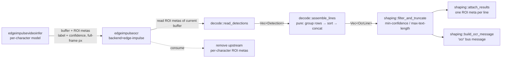

# `edgeimpulseocr` — `edge-impulse` backend design

- **Date:** 2026-07-10
- **Status:** Approved (ready for implementation plan)
- **Scope:** `gst-plugin-edgeimpulse` only. VIS web-UI / firmware integration is a separate follow-up.

## Problem

`edgeimpulseocr` currently ships two backend values for its `backend` property:

- `ocrs` (default) — a self-contained, pure-Rust text detector + recognizer that runs on the
  raw RGB frame on a background worker thread.
- `edge-impulse` — a **planned no-op placeholder**. Selecting it today wires the element to
  `NoopBackend`, so it recognizes nothing.

The documented intent for `edge-impulse` is: *"decode text from an upstream Edge Impulse
recognition model, letting you train and deploy custom OCR models via Edge Impulse Studio."*

This design implements that backend.

## Goal

Make `edgeimpulseocr backend=edge-impulse` decode the output of an **upstream**
`edgeimpulsevideoinfer` element (running an Edge Impulse object-detection model where each
detected box is a single character/glyph) into lines of text, emitting the **same** `ocr` bus
message and per-line `VideoRegionOfInterestMeta` that the `ocrs` backend produces. Downstream
consumers (`edgeimpulseoverlay`, the VIS firmware) require **no** changes.

Target pipeline:

```
… ! videoconvert ! video/x-raw,format=RGB \
    ! edgeimpulsevideoinfer <per-character detection model> \
    ! edgeimpulseocr backend=edge-impulse \
    ! edgeimpulseoverlay ! …
```

## Resolved design decisions

| Question | Decision |
|----------|----------|
| What does the upstream model produce? | **Object detection**: each detected box = one character/glyph; the class `label` is the character. |
| Where does the backend read that from? | The **`gst_video::VideoRegionOfInterestMeta`** entries `edgeimpulsevideoinfer` attaches to the buffer. |
| Why not the raw `result_json`? | `InferenceResultMeta.result_json` carries box coordinates in **model-input** resolution with no scale factor. The ROI metas are already scaled to **full-frame pixels** (via `scale_bounding_box` in the video element) and carry `label` + `confidence` in a `detection` param — exactly what we need, in the right coordinate space. |
| How are boxes assembled into text? | **Multi-line**: group boxes into rows by vertical overlap, sort each row left-to-right, concatenate labels, emit one line per row. |
| Space insertion between characters? | **No** automatic spaces in v1 (deterministic; correct for codes / serials / plates). Gap-based spacing is a possible future property. |
| Line confidence? | **Minimum** of the member characters' confidences (a line is only as trustworthy as its weakest glyph; makes `min-confidence` mean "every character cleared the threshold"). |
| Upstream per-character ROI metas after decoding? | **Consumed** (removed), so downstream renders clean per-line text instead of double-rendering character boxes. |
| Backend selection? | **Explicit** via the existing `backend` property (`edge-impulse`). |
| Integration architecture? | **Approach A** — synchronous inline decode in `transform_ip`, bypassing the worker thread; converges on the existing `shaping` output path. |

### Approaches considered

- **A (chosen) — inline synchronous decode.** The `edge-impulse` path does not use the worker
  thread. `transform_ip` reads the current buffer's ROI metas, runs a pure `assemble_lines`
  function, and feeds the result into the existing `shaping` helpers on the same frame (zero
  lag). The worker thread is spawned only for pixel backends (`ocrs`).
  - *Pros:* respects that the two backends have fundamentally different data sources (pixels vs
    metadata) and cost profiles (heavy async vs cheap sync); zero lag; the decode core is a pure,
    host-testable function; minimal disruption to the `ocrs` path.
  - *Cons:* one extra branch in `transform_ip` (small; converges quickly at `shaping`).
- **B — generalize the `OcrBackend` trait** to a unified `OcrInput { Rgb | Detections }` routed
  through the worker. *Rejected:* forces the cheap synchronous meta-decode through the async
  worker (adding lag for no benefit), makes the trait leaky (each impl ignores half the input),
  and still requires extracting owned `Detection`s on the streaming thread because ROI metas are
  not `Send`.
- **C — run an Edge Impulse model inside the element via FFI.** *Rejected:* contradicts the
  "upstream" design, duplicates `edgeimpulsevideoinfer`, and runs a second heavy inference.

## Architecture

### Data flow



### New module: `src/ocr/decode.rs`

Declared in `src/ocr/mod.rs` (not feature-gated — must compile with `--no-default-features`).

```rust
/// One upstream character detection, in full-frame pixels.
pub struct Detection {
    pub label: String,
    pub confidence: f32,
    pub x: u32,
    pub y: u32,
    pub w: u32,
    pub h: u32,
}

/// Read per-character detections from a buffer's `VideoRegionOfInterestMeta`
/// entries. Only ROI metas carrying a `detection` param (the Edge Impulse
/// convention: `label` + `confidence`) are considered; others are ignored.
/// Impure (touches GStreamer); returns owned data so callers can then mutate
/// the buffer (e.g. remove the consumed metas) without borrow conflicts.
pub fn read_detections(buf: &gst::BufferRef) -> Vec<Detection>;

/// Assemble character detections into text lines. Pure, host-testable.
pub fn assemble_lines(dets: &[Detection]) -> Vec<OcrLine>;
```

### `assemble_lines` algorithm (pure)

1. Drop detections with an empty `label`.
2. **Row grouping by vertical overlap.** Sort by `y`; greedily assign each box to a row. A box
   joins the current row if the vertical overlap of its `[y, y+h]` interval with the row's
   interval is ≥ 50% of the shorter of the two heights; otherwise it starts a new row. The row's
   interval is the union of its members' vertical extents.
3. **Order within a row** left-to-right by `x` (tie-break by x-center).
4. **Concatenate** member `label`s verbatim (no inserted spaces).
5. **Line confidence** = minimum of the members' confidences.
6. **Line bounding box** = union of the members' boxes (full-frame pixels).
7. **Order rows** top-to-bottom by their vertical position, so emitted lines and `ocr` messages
   follow reading order.

Output: one `OcrLine { text, confidence, x, y, w, h }` per row.

### `imp.rs` changes

- **Worker only for pixel backends.** `start()` spawns the recognition worker thread only when
  the configured backend consumes pixels (`ocrs`). For `edge-impulse` there is no worker. The
  `State` distinguishes the two modes (e.g. an enum `Worker { … } | Inline { … }`, or optional
  worker fields — an implementation detail for the plan). `backend` is `mutable_ready`, so it is
  stable for the lifetime of a `start()`/`stop()` cycle.
- **`transform_ip` branches early.** If the backend is `edge-impulse`:
  1. `let dets = decode::read_detections(buf);`
  2. Remove the consumed per-character ROI metas from `buf`.
  3. `let lines = decode::assemble_lines(&dets);`
  4. `let lines = shaping::filter_and_truncate(lines, min_confidence, max_text_length);`
  5. `shaping::attach_results(buf, &lines);` (per-line ROI metas)
  6. If `post_message` and this frame is due per the message-throttle counter, post one `ocr`
     message per line (timestamp = current buffer PTS in ms).

  Otherwise, the existing `ocrs` worker path runs unchanged.

## Property semantics (edge-impulse path)

| Property | Behavior |
|----------|----------|
| `min-confidence` | **Meaningful.** Filters lines whose weakest character is below the threshold (per-character confidence is available upstream). |
| `max-text-length` | Honored — truncates each line by character count (existing `filter_and_truncate`). |
| `post-message` | Honored — posts `ocr` messages. |
| `interval` | Throttles **`ocr` message posting only** (avoids flooding the bus at frame rate). ROI consume + per-line attach happen on **every** frame, so the overlay stays stable. (For this backend there is no heavy recognition to throttle; message cadence is the only meaningful knob.) |
| `detection-model` / `recognition-model` | **Ignored** — no models are loaded in-element. |

- **Caps** remain `video/x-raw, RGB`. The pixels are unused by this backend, but the pipeline
  already carries RGB and keeping caps uniform avoids negotiation complexity.
- **Build/features:** the `edge-impulse` path and `decode.rs` are always compiled; only
  `ocrs_backend` stays behind the `ocrs` cargo feature. `backend=edge-impulse` therefore works in
  a minimal `--no-default-features` build.

## Error handling / edge cases

- No detections on a buffer → no output, no message; the buffer passes through. Not an error.
- A `VideoRegionOfInterestMeta` without a `detection` param → ignored (not an EI detection).
- Detections are copied into owned `Detection`s **before** removing metas, avoiding borrow
  conflicts; per-line ROI metas are attached **after** removal so we never remove our own output.
- Empty `label` → dropped; zero-size boxes are tolerated (the union handles them).
- The in-place `BaseTransform` already yields a writable buffer (it attaches metas today).

## Testing

- **`decode::assemble_lines`** (pure, no GStreamer): single-row ordering; two-row grouping;
  shuffled input; top-to-bottom reading order; minimum-confidence aggregation; union bounding
  box; empty input; single detection; empty labels dropped.
- **`decode::read_detections`** (`gst::init`): builds a buffer, adds `VideoRegionOfInterestMeta`
  with `detection` params, asserts extracted `label`/`confidence`/rect; skips metas without a
  `detection` param; empty buffer → empty.
- **Consume behavior** (`gst::init`): after processing a buffer, only per-line ROI metas remain,
  not the per-character ones.
- **Regression:** the existing `ocrs`, `shaping`, and `backend` tests continue to pass.

## Documentation updates

- `docs/edgeimpulseocr.md`: promote `edge-impulse` from "planned / recognizes nothing" to
  implemented; document the upstream pipeline, the per-character detection-model expectation,
  coordinate handling, per-property applicability (meaningful `min-confidence`; ignored
  `detection-model`/`recognition-model`; `interval` = message throttle), and add an example
  pipeline chaining `edgeimpulsevideoinfer ! edgeimpulseocr backend=edge-impulse`.
- Update the `backend` property blurb and any inline comments that state `edge-impulse`
  recognizes nothing.

## Out of scope / future work

- **VIS integration** (exposing `backend=edge-impulse` in the OCR Reader block, chaining an
  upstream inference node in the compiler/firmware). VIS Plan 2 ships with `backend=ocrs`
  hardcoded; adding the `edge-impulse` variant there is a separate spec.
- **Gap-based space insertion** as an optional property.
- **Result caching / re-attach** for pipelines where the upstream element throttles inference
  hard (so some buffers arrive without fresh detections). Not needed when upstream produces
  detections every frame.
- An `examples/` entry demonstrating the two-element pipeline end to end.
